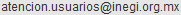

# gmmx10: Global Map Mexico 1.0
## non-commercial use
 
## commercial use

## note
Notice: Global Map Mexico is free of charge for non-commercial use. However when you make public any work that uses the data, you will need to show the credit and send mail to us describing your contact information, particular data set used and purpose of use.

Credit: (R) Global Map Mexico (C) ISCGM/INEGI

Contact: INEGI 

E-mail: 

